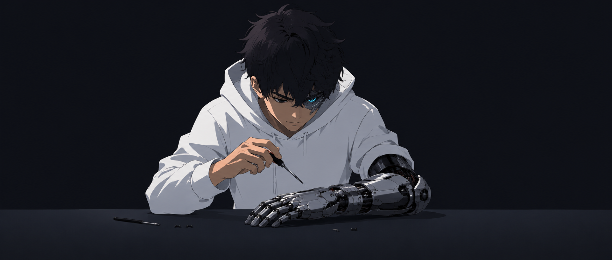

  

---
# Heyo! I am Sina 👋
## Computer Science Undergraduate
## 🚀 About Me

I'm a Computer Science student who enjoys exploring **how software works beneath the surface**.

Whenever I learn something new, I usually:

- 💻 Build a project
- 📝 Write detailed notes
- ⚙️ Create a utility
- 🧪 Experiment until I understand it

I'm less interested in memorizing APIs and more interested in understanding **why things work**.

---

## 🛠 Tech Stack

*Interactive 3D Neural Network:* In the portfolio's Skills section, skills are mapped as nodes across the dual cerebral hemispheres of a 3D brain model with synaptic firing pulses, orbit rotation, and context inspection.

*Interactive Time-Travel Calendar:* In the Trajectory & Journey timeline section, a minimalist kinetic calendar widget in portfolio blue tracks along with the scroll, smoothly animating backwards through months and years (June 2026 ➔ September 2022) as you scroll down through milestones, and forward as you scroll up.

---

## 🔥 Interests

- **🧑‍💻 Software development**
  - Specially automation software... I love it when I can relieve others of their torments...
- **🤖 Artificial Intelligence**
  - I adore a topic that seems straightforward at first but backfires in an instance
- **⚡ Game development**
  - Everyone secretly wants to design their own games, I believe
  - *Interactive Feature:* Meet the cute Blue Nom Nom monster in his dedicated interactive box under the direct message card — he tracks your cursor, chomps it down with full cursor hiding, chews for 3 seconds, spits the cursor back out where it respawns, and rests for 3 seconds before eating again. Transform your cursor into snacks (🍗 Chicken, 🍕 Pizza, 🍔 Burger, 🥤 Soda, or ↖ Normal Cursor) and feed him soda to trigger a hilarious bubbly *BLURP!* effect! 🍬😋
- **🦾 Bionics**
  - **Fun Fact:** I was originally studying biology but I changed my program
  - *Interactive Feature:* Check out the hero section bionic ocular sensor — track the cursor, click to glitch, or shake your cursor frantically to make it dizzy! 😵‍💫

### 🔬 Current Focus

- 📚 Data Structures & Algorithms
- 📐 Linear Algebra
- 🧩 Combinational Optimization
- 🖥 Backend Development
- 🏗 Software Design
- 🤖 AI-assisted Development & Productivity

---

## 📦 Featured Project

### 🛠 Utilities

A growing collection of tools that make everyday tasks easier.

Instead of searching for the perfect website or application every time, I'm gradually building my own collection of utilities that I can access whenever I need them.

This project is both a productivity toolkit and a playground for learning new techniques.

---

## 📖 Learning Philosophy

> *"I just want to know how it works and how I can improve it..."*

Most of my repositories are experiments rather than finished products.

Every commit represents something I learned, improved, broke, fixed, or finally understood.

I'm a firm believer that **small improvements made consistently compound into meaningful progress.**

---

## 👾 Beyond Programming

When I'm not coding, you'll probably find me:

- 🎮 Exploring games
- 🎨 Drawing surreal artwork
- 📚 Learning something completely unrelated to programming
- ☕ Thinking about the next small project to build

---

## 🎯 Current Goals

- 🚀 Build larger real-world software projects
- ⚙️ Become a stronger backend developer
- 🧠 Strengthen algorithmic thinking
- 🤝 Contribute to open source
- 📚 Keep learning, one project at a time

---

### Thanks for stopping by! 🍀

